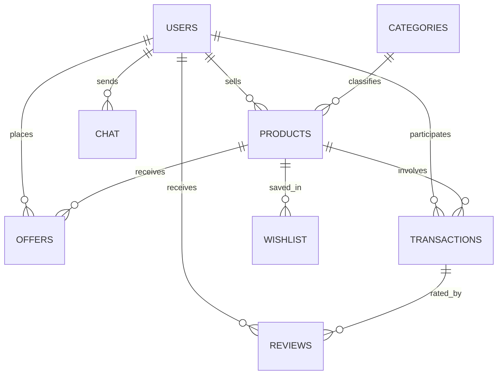

# ReMarket - HOSTEL RESALE MANAGEMENT SYSTEM
## DBMS Project Report (UCS310)

**Session-Year:** Jan-May, 2026  
**Department:** Computer Science and Engineering  
**Institution:** Thapar Institute of Engineering and Technology, Patiala

### Team Members:
| Name | Roll Number |
| :--- | :--- |
| Sarwangini Hamal | 1024170262 |
| Aashi Tyagi | 1024170263 |
| Kirandeep Kaur | 1024170280 |
| Gauransh Arora | 1024170264 |

**Class Group:** 2Q25  
**Submitted to:** Dr. Reaya Grewal

---

## TABLE OF CONTENTS
1. [Introduction](#introduction)
2. [Problem Statement](#problem-statement)
3. [Objectives of the Project](#objectives-of-the-project)
4. [Scope of the Project](#scope-of-the-project)
5. [Proposed System Description](#proposed-system-description)
6. [Database Design](#database-design)
   - [Entity–Relationship (ER) Design](#entity-relationship-er-design)
   - [Relational Schema](#relational-schema)
7. [Normalization](#normalization)
8. [Database Implementation](#database-implementation)
   - [SQL Implementation](#sql-implementation)
   - [Advanced PL/pgSQL Logic](#advanced-plpgsql-logic)
9. [Transaction Management & Concurrency](#transaction-management--concurrency)
10. [Tools and Technologies](#tools-and-technologies)
11. [Expected Outcomes](#expected-outcomes)

---

## INTRODUCTION
ReMarket is a specialized E-Commerce and Marketplace Management System designed to facilitate a sustainable circular economy within hostel environments. It provides a centralized platform for students to buy and sell used items—such as textbooks, electronics, furniture, and daily appliances—within a trusted, university-controlled ecosystem.

The motivation stems from the high turnover of student belongings at the end of academic semesters. Traditional file-based systems or informal social media groups (WhatsApp/Telegram) lack the necessary structure for data integrity, secure transaction tracking, and trust management. ReMarket leverages a robust Relational Database Management System (RDBMS) to ensure:
- **Data Integrity:** Enforcing referential integrity between users, products, and transactions.
- **Concurrency Control:** Preventing race conditions such as double-selling an item.
- **Transaction Safety:** Utilizing ACID properties to ensure purchase operations are atomic.
- **Advanced Logic:** Implementing triggers and stored procedures for business rules like Sunday-only offers and automated reputation scoring.

---

## PROBLEM STATEMENT
Hostel students frequently purchase temporary items that become redundant at the end of a semester. Currently, resale happens through fragmented channels (notice boards, WhatsApp groups) which suffer from:
- **No Centralization:** Buyers cannot easily search for items or compare prices.
- **Lack of Accountability:** No record of transactions or user reliability (trust scores).
- **Inconsistent Pricing:** No history of negotiation or offer tracking.
- **Data Anomalies:** Risk of "double-selling" or listing items that are no longer available.

### The Database Solution
ReMarket solves these issues by providing a structured relational model that enforces business rules through database-level constraints and triggers, ensuring a secure, transparent, and efficient marketplace.

---

## OBJECTIVES OF THE PROJECT
- **Conceptual Modeling:** Design an ER diagram and map it to a normalized relational schema.
- **Data Integrity:** Apply constraints (PK, FK, CHECK, UNIQUE) to ensure data validity.
- **Normalization:** Achieve 3NF/BCNF to eliminate redundancy and update anomalies.
- **Business Logic Automation:** Implement PL/pgSQL triggers for Sunday-only offer placement and trust score calculations.
- **Concurrency Management:** Use row-level locking and transaction isolation to prevent double-selling.
- **Analytics:** Enable complex SQL queries to track sales trends, popular categories, and top-rated sellers.

---

## SCOPE OF THE PROJECT
ReMarket covers the entire lifecycle of a campus transaction:
- **User Management:** Role-based access for Students and Admins, including reputation tracking.
- **Product Catalog:** Categorized listings with status tracking (Draft, Active, Reserved, Sold).
- **Negotiation System:** A unique "Sunday-Only" offer mechanism enforced via database triggers.
- **Communication:** Real-time chat system between buyers and sellers associated with specific products.
- **Transaction Processing:** Secure checkout flow using stored procedures for atomicity.
- **Feedback Loop:** Post-transaction reviews that automatically update user trust scores.

---

## PROPOSED SYSTEM DESCRIPTION
The system architecture follows a modern web stack with a PostgreSQL backend. 
- **Product Lifecycle:** Products move from `Draft` to `Active`. When a buyer places an offer (on Sundays), and the seller accepts, the product is marked as `Reserved` or `Sold` immediately.
- **Offer Mechanism:** To prevent marketplace fatigue, offers can only be placed on Sundays. This is strictly enforced by a database trigger, ensuring the business rule is followed regardless of frontend bypass.
- **Trust System:** After a transaction, users rate each other. A PL/pgSQL function calculates the running average and updates the `trust_score` in the `users` table.
- **Atomic Deals:** A stored procedure handles the finalization of a sale, locking the product row to ensure that no two buyers can purchase the same item simultaneously.

---

## DATABASE DESIGN

### Entity–Relationship (ER) Design
The system consists of the following primary entities:
- **USERS:** Core identity table (ID, Name, Email, Trust Score, Status).
- **PRODUCTS:** Items listed for sale (Seller ID, Category, Price, Condition, Status).
- **CATEGORIES:** Classification system for products.
- **OFFERS:** Bid records (Product ID, Buyer ID, Offered Price, Status).
- **TRANSACTIONS:** Finalized sale records (Buyer, Seller, Product, Final Price).
- **REVIEWS:** Peer feedback (Transaction ID, Rating, Comment).
- **CHAT:** Communication logs linked to products.
- **WISHLIST:** Saved items for future reference.



### Relational Schema
1. **USERS** (`id` PK, `name`, `email` UNIQUE, `phone`, `role`, `trust_score`, `status`, `created_at`)
2. **CATEGORIES** (`category_id` PK, `name` UNIQUE, `description`)
3. **PRODUCTS** (`product_id` PK, `seller_id` FK, `category_id` FK, `name`, `price`, `condition`, `status`, `created_at`)
4. **OFFERS** (`offer_id` PK, `product_id` FK, `buyer_id` FK, `offered_price`, `offer_date`, `offer_status`)
5. **TRANSACTIONS** (`transaction_id` PK, `product_id` FK, `buyer_id` FK, `seller_id` FK, `offer_id` FK, `final_price`, `status`)
6. **REVIEWS** (`review_id` PK, `transaction_id` FK, `reviewer_id` FK, `reviewee_id` FK, `rating`, `comment`)
7. **CHAT** (`message_id` PK, `product_id` FK, `sender_id` FK, `receiver_id` FK, `message_text`, `sent_at`)
8. **WISHLIST** (`wishlist_id` PK, `user_id` FK, `product_id` FK)

---

## NORMALIZATION
The database is designed to satisfy **Third Normal Form (3NF)**:
- **1NF:** Every column contains atomic values; no repeating groups. UUIDs are used for unique identification.
- **2NF:** Every non-key attribute is fully functionally dependent on the Primary Key. (e.g., `Price` depends on `Product_ID`).
- **3NF:** No transitive dependencies. User details (Name, Email) are stored only in the `USERS` table and referenced via `id` in `PRODUCTS` and `TRANSACTIONS`.

---

## DATABASE IMPLEMENTATION

### SQL Implementation
PostgreSQL is utilized for its advanced indexing and robust support for procedural logic.
- **Constraints:** `CHECK` constraints ensure prices are > 0 and status values match the defined lifecycle (e.g., `CHECK (status IN ('Draft', 'Active', 'Reserved', 'Sold'))`).
- **Indexes:** Created on `seller_id`, `product_id`, and `category_id` to optimize search performance.
- **Views:** Active listings are served through views to simplify frontend queries.

### Advanced PL/pgSQL Logic
The core "intelligence" of ReMarket resides in the database layer:
1. **Automated Reputation System:** A trigger `trg_recalculate_trust` fires on every new review to update the seller's average trust score.
2. **Offer Restrictions:** The trigger `trg_enforce_sunday_offers` uses `EXTRACT(DOW FROM NOW())` to block any offer placement made on days other than Sunday.
3. **Marketplace Synchronization:** When a product's status changes to 'Sold', a trigger automatically removes it from all users' wishlists and rejects all other pending offers for that item.
4. **Fraud Prevention:** Triggers prevent users from reviewing themselves or placing offers on their own products.

---

## TRANSACTION MANAGEMENT & CONCURRENCY
ReMarket ensures **ACID Compliance** through:
- **Atomicity:** The `sp_finalize_deal` stored procedure wraps the transaction record creation, product status update, and offer acceptance into a single atomic block.
- **Isolation (Concurrency Control):** To prevent "Double Selling," the system uses **Row-Level Locking**.
  ```sql
  -- Logic inside sp_finalize_deal
  PERFORM * FROM products WHERE product_id = p_id FOR UPDATE;
  ```
  This locks the product record for the duration of the transaction, forcing any concurrent purchase attempts to wait until the current one is committed or rolled back.

---

## TOOLS AND TECHNOLOGIES
- **RDBMS:** PostgreSQL (hosted on Supabase)
- **Procedural Language:** PL/pgSQL (for Triggers and Stored Procedures)
- **GUI Tool:** pgAdmin / Supabase Dashboard
- **Backend:** Node.js with `pg` driver (PostgreSQL client)
- **Frontend:** React with TypeScript (Vite)
- **Authentication:** Supabase Auth (integrated with `users` table via foreign keys)

---

## EXPECTED OUTCOMES
- **Efficiency:** A centralized hub for hostel resale, reducing waste and clutter.
- **Trust:** A verified reputation system that discourages fraudulent behavior.
- **Data Integrity:** Elimination of double-selling and invalid product listings.
- **Scalability:** A robust database design capable of handling thousands of listings across multiple hostels.
- **Analytics:** Data-driven insights into campus spending habits and popular item categories.
